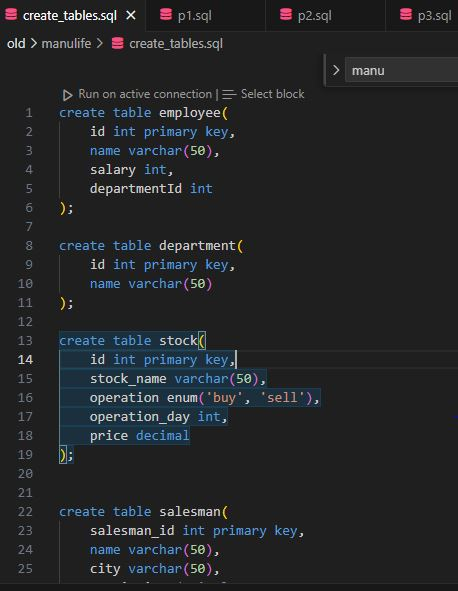
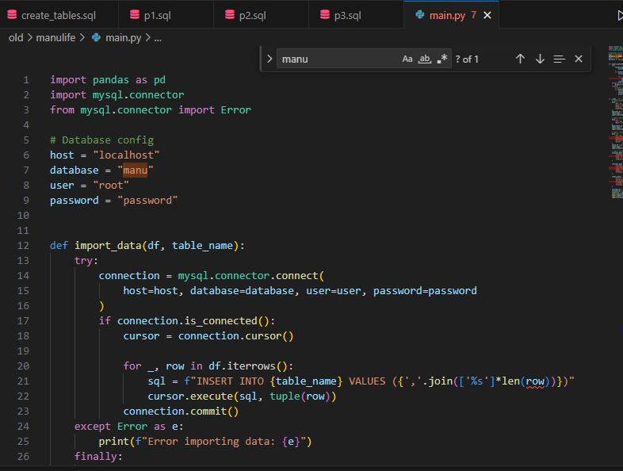
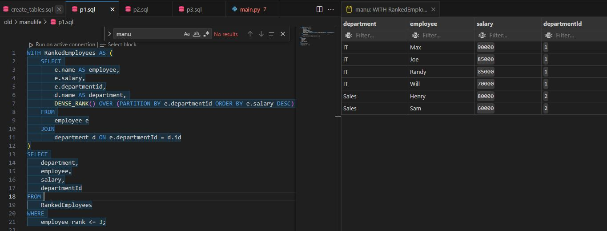
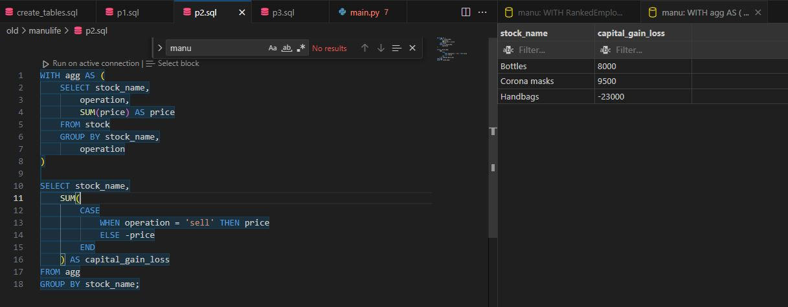
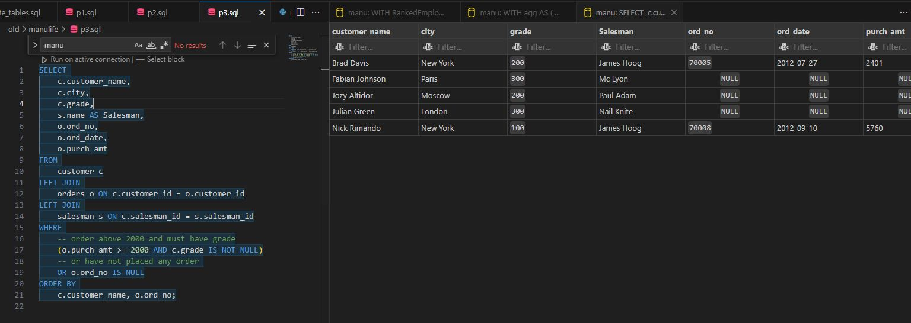

# SQL exercise

## Query Details:

- **Create table schemas**: Create table schemas using create_tables.sql

- **Insert data**: Insert data using insert_data.py. This updates values in table using pandas dataframe

- **P1**

- **P2**

- **P3**

